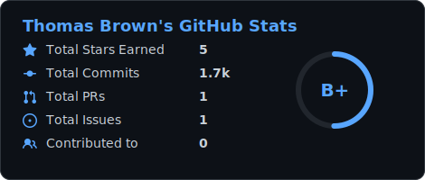
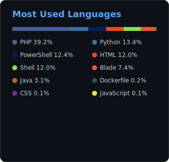

# 👋 Hi, I'm Thomas Brown

### Full-Stack Software Engineer · Web & Mobile · DevOps

Building scalable, reliable, user-focused digital products. From modern web apps and cross-platform mobile to automated deployment pipelines.

---

## 🚀 What I Do

- 🧩 &nbsp;Build full-stack web applications
- 📱 &nbsp;Develop cross-platform mobile apps
- ⚙️ &nbsp;Design backend APIs and database-driven systems
- ☁️ &nbsp;Automate deployment and DevOps workflows
- 🧠 &nbsp;Explore new technologies and solve real-world problems

---

## 🧰 Tech Stack

**Frontend**

  &nbsp;&nbsp;
  &nbsp;&nbsp;
  &nbsp;&nbsp;
  &nbsp;&nbsp;
  &nbsp;&nbsp;
  

**Backend**

  &nbsp;&nbsp;
  &nbsp;&nbsp;
  &nbsp;&nbsp;
  &nbsp;&nbsp;
  &nbsp;&nbsp;
  &nbsp;&nbsp;
  

**Mobile**

  &nbsp;&nbsp;
  

**DevOps & Tools**

  &nbsp;&nbsp;
  &nbsp;&nbsp;
  &nbsp;&nbsp;
  &nbsp;&nbsp;
  &nbsp;&nbsp;
  

---

## 🌟 Featured Projects

| Project | Description | Tech Stack |
|---------|-------------|------------|
| **EMIS System** | Educational management information system supporting school and institutional workflows. | PHP · Laravel · MySQL |
| **Pay Money App** | Mobile-focused financial transaction app built for secure, convenient payments. | Flutter · REST APIs |
| **Web Apps & Dashboards** | Responsive web platforms, admin dashboards, and business applications. | React · Vue.js · Node.js |
| **Automation & Deployment** | CI/CD workflows and deployment automation for smoother dev operations. | GitHub Actions · Linux · Bash |

---

## 📊 GitHub Stats

&nbsp;&nbsp;

Cards are generated by a scheduled GitHub Action and served as static files from this repo — no external stats service, no rate limits.

---

<table>
  <tr>
    <td valign="top" width="50%">

### 🌱 Currently Exploring

- Scalable backend architecture
- Cloud deployment & DevOps workflows
- Cross-platform mobile performance
- API design & system optimization
- AI-assisted software development

  </td>
  <td valign="top" width="50%">

### 🤝 Let's Collaborate

I'm open to working on:

- Full-stack web applications
- Mobile app development
- Backend systems & APIs
- Open-source projects
- Startup & product ideas
- DevOps & deployment workflows

  </td>
  </tr>
</table>

**Got an idea worth building? Let's connect and bring it to life.**

⚡ &nbsp;*Fun fact: I enjoy turning complex problems into simple, useful software.*

